# AP Autopilot


</p>
AI-Powered Accounts Payable Invoice Review using Snowflake SQL, Python CLI and Gemini
Built for the **Snowflake AI Data Cloud Hackathon 2026**, AP Autopilot demonstrates how deterministic SQL decision making can be combined with AI-generated business explanations to automate enterprise Accounts Payable invoice review while maintaining complete auditability.
---

## Project Statistics

| Metric | Value |
|----------|------|
| Programming Language | Python 3.12 |
| SQL Objects | 15+ |
| CLI Commands | 3 |
| Screenshots | 15 |
| Vendor Contracts | 10 |
| Synthetic Vendors | 10 |
| Invoice Reviews | 20+ |
| Architecture Layers | 5 |

## Overview

AP Autopilot is an AI-powered Accounts Payable (AP) invoice review system that automates invoice reconciliation by combining deterministic SQL rules with AI-generated business explanations.

The project ingests invoices, purchase orders, vendor information, payment history, and contract data into Snowflake, where SQL-based validation rules detect duplicate invoices, contract violations, pricing discrepancies, expired agreements, and vendor-related risks. These business rules generate a deterministic recommendation for every invoice.

A lightweight Python CLI orchestrates the workflow by retrieving the SQL results, applying additional fail-safe governance rules when required (such as missing or expired contracts), generating a concise business explanation using Google's Gemini API, and recording every decision in an immutable audit log.

Unlike traditional AI-first solutions, AP Autopilot keeps all business decisions deterministic and fully auditable. Large Language Models are used only to explain completed decisions in natural language and never influence the approval, hold, or escalation outcome.

This architecture provides transparent decision making, complete traceability, and a clear separation between business logic, orchestration, and language generation, making the system suitable for enterprise finance workflows.
---

## Problem Statement

Accounts Payable teams process thousands of invoices every month. Manual invoice reconciliation is time-consuming and prone to errors, especially when invoices must be verified against purchase orders, historical payments, and vendor contracts.

Common issues include:

- Duplicate invoices submitted for payment
- Unit prices exceeding contracted rates
- Expired vendor agreements
- Missing contract documentation
- High-risk vendors requiring manual review

Traditional review processes rely heavily on human analysts, resulting in delayed approvals, inconsistent decision making, and increased operational costs.

The objective of AP Autopilot is to automate this reconciliation process while ensuring that every approval decision remains deterministic, explainable, and fully auditable.

---

## Solution Overview

AP Autopilot combines deterministic SQL decision making with AI-assisted explanations to automate the Accounts Payable invoice review process.

The solution follows a layered architecture where each component has a clearly defined responsibility:

- **Snowflake SQL** performs invoice validation, contract verification, anomaly detection, vendor risk assessment, and recommendation generation using deterministic business rules.
- **Python CLI** orchestrates the workflow by retrieving SQL results, applying fail-safe governance rules, coordinating the review process, and recording all decisions.
- **Gemini API** generates concise business-friendly explanations for completed decisions without influencing the approval outcome.
- **Audit Logging** stores every review decision, supporting evidence, timestamps, and decision source to provide complete traceability.

The system evaluates every invoice against purchase orders, vendor contracts, historical payments, and predefined business rules before assigning one of three actions:

- **Auto Approve** – No anomalies detected and all validation checks pass.
- **Manual Review** – Moderate risk detected, requiring an analyst's review.
- **Escalate** – Critical issues such as expired contracts, missing contracts, or severe pricing anomalies are detected.

This layered design separates business logic from natural language generation, ensuring that every financial decision remains deterministic, transparent, and fully auditable.

---

## Key Features

- Deterministic invoice approval using Snowflake SQL business rules
- Duplicate invoice detection
- Contract price validation against purchase orders
- Vendor contract status monitoring (Active, Expiring Soon, Expired)
- Contract clause analysis
- Vendor risk assessment
- Invoice anomaly detection
- Python fail-safe governance for missing and expired contracts
- AI-generated executive summaries using Google's Gemini API
- Complete audit logging with decision source tracking
- Interactive command-line interface for invoice review and contract inspection
- Fully reproducible synthetic data generation
- Modular architecture separating SQL, orchestration, and AI explanation layers

---

## System Architecture

AP Autopilot follows a layered architecture where deterministic business logic, workflow orchestration, and AI-generated explanations are intentionally separated. This ensures that financial decisions remain transparent, auditable, and reproducible.

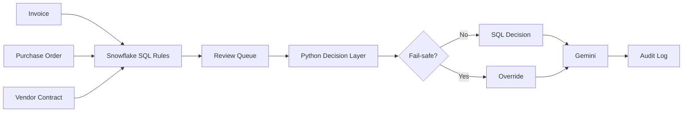

---

## Project Workflow

The invoice review process follows six sequential stages:

1. **Data Ingestion**
   - Load invoices, purchase orders, vendor data, payment history, and contract information into Snowflake.

2. **Business Rule Execution**
   - SQL scripts validate invoices against contracts, purchase orders, and historical transactions.
   - Vendor risk scores and anomaly detection results are generated.

3. **Review Queue Generation**
   - All validation results are consolidated into the AP Review Queue.

4. **Decision Orchestration**
   - Python retrieves the SQL recommendations.
   - Fail-safe rules override the SQL recommendation only when mandatory governance conditions are met (for example, missing or expired contracts).

5. **Business Explanation**
   - Gemini generates an executive-friendly explanation using the completed decision and supporting evidence.
   - The language model never changes the final decision.

6. **Audit Logging**
   - The completed decision, supporting evidence, explanation, and decision source are written to the audit log.

---

## Project Structure

```text
ap-autopilot/
│
├── cli/
│   ├── cli.py
│   ├── decision_skill.py
│   ├── gemini_reasoner.py
│   ├── invoice_anomaly_skill.py
│   ├── contract_clause_skill.py
│   └── snowflake_client.py
│
├── data/
│   ├── output/
│   │   ├── contracts/
│   │   ├── invoices.csv
│   │   ├── payment_history.csv
│   │   ├── purchase_orders.csv
│   │   ├── vendors.csv
│   │   └── contract_pricing.csv
│   │
│   ├── generate_synthetic_data.py
│   ├── generate_contracts.py
│   ├── convert_contracts_to_pdf.py
│   └── build_contract_pricing_csv.py
│
├── docs/
│   └── screenshots/
│
├── sql/
│   ├── 01_schema.sql
│   ├── 02_semantic_view.sql
│   ├── 03_stage_and_search.sql
│   └── additional_analysis.sql
│
├── .env.example
├── .gitignore
├── requirements.txt
├── LICENSE
└── README.md
```

---

## Technologies Used

| Category | Technologies |
|-----------|--------------|
| Cloud Platform | Snowflake AI Data Cloud |
| Database | Snowflake |
| Language | Python 3.12 |
| SQL | Snowflake SQL |
| AI | Google Gemini 2.5 Flash |
| CLI | Python Command Line Interface |
| Data Processing | Pandas |
| Configuration | python-dotenv |
| Database Connector | snowflake-connector-python |
| Version Control | Git & GitHub |
| IDE | PyCharm Professional |

---

## Database Design

The solution uses Snowflake as the central data platform. Structured invoice data, purchase orders, vendor information, payment history, and derived analytical tables are stored inside the **AP_AUTOPILOT** database.

The database follows a layered design:

- **Raw Operational Tables** store invoices, purchase orders, vendor records, and payment history.
- **Derived Analysis Tables** store anomaly detection results, contract analysis, pricing comparisons, and review recommendations.
- **Views** provide business-friendly summaries such as vendor risk scores and contract status.
- **Stages** store vendor contract PDF documents.
- **Semantic Views** expose structured business entities for analytical workloads.

This separation keeps raw operational data independent from analytical outputs while allowing each layer to evolve independently.

---

## SQL Objects

### Tables

| Table | Purpose |
|---------|---------|
| VENDORS | Vendor master information |
| PURCHASE_ORDERS | Purchase order details |
| INVOICES | Invoice records |
| PAYMENT_HISTORY | Historical payments |
| CONTRACT_TEXT | Parsed contract text |
| CONTRACT_TEXT_MAPPED | Vendor-to-contract mapping |
| CONTRACT_PRICING | Contract pricing extracted from generated contracts |
| CONTRACT_CLAUSE_ANALYSIS | Clause analysis results |
| CONTRACT_PRICE_CHECK | Contract vs Purchase Order price comparison |
| INVOICE_ANOMALY_RESULTS | SQL anomaly detection results |
| AP_REVIEW_QUEUE | Final review queue generated by SQL |
| AUDIT_LOG | Complete audit trail of decisions |

### Views

| View | Purpose |
|------|----------|
| CONTRACT_STATUS | Active, Expiring Soon, Expired contracts |
| VENDOR_RISK_SCORE | Vendor risk assessment |

### Stage

| Stage | Purpose |
|--------|---------|
| CONTRACT_DOCS | Stores vendor contract PDF files |

### Semantic View

| Semantic View | Purpose |
|---------------|----------|
| AP_SEMANTIC_VIEW | Business-friendly semantic model for Accounts Payable data |

---

## Python Components

| Module | Responsibility |
|----------|---------------|
| snowflake_client.py | Creates and manages Snowflake connections |
| invoice_anomaly_skill.py | Retrieves SQL-generated invoice anomaly results |
| contract_clause_skill.py | Retrieves contract analysis and pricing evidence |
| decision_skill.py | Combines SQL evidence and applies Python fail-safe governance |
| gemini_reasoner.py | Converts completed decisions into executive-friendly explanations |
| cli.py | Command-line interface that orchestrates the entire workflow |

---

## CLI Commands

The project exposes three primary CLI commands for interacting with the Accounts Payable review workflow.

| Command | Description |
|----------|-------------|
| `python cli.py review-invoice <INVOICE_ID>` | Reviews a single invoice and generates a business explanation. |
| `python cli.py scan-open-invoices` | Reviews every invoice currently present in the AP Review Queue. |
| `python cli.py inspect-contract <VENDOR_ID>` | Displays contract status, clause analysis, and pricing comparison for a vendor. |

### Examples

```bash
python cli.py review-invoice INV0007

python cli.py scan-open-invoices

python cli.py inspect-contract V003
```

---

## Example Outputs

### Escalated Invoice

An invoice issued against an expired contract is automatically escalated by the Python fail-safe layer.

```text
Decision: ESCALATE

Severity: HIGH

Decision Source: PYTHON_FAIL_SAFE
```

---

### Manual Review

A contract price mismatch is detected by the SQL rules engine.

```text
Decision: MANUAL REVIEW

Severity: MEDIUM

Decision Source: SNOWFLAKE_SQL
```

---

### Auto Approval

Invoices with no anomalies automatically proceed through the happy path.

```text
Decision: AUTO APPROVE

Severity: LOW

Decision Source: SNOWFLAKE_SQL
```

---

### Contract Inspection

Displays:

- Contract status
- Clause analysis
- Contract pricing
- Purchase order comparison

---

### Invalid Input

Invalid invoice IDs are validated before processing.

```text
Input Error

No invoice found with ID INV9999
```
---
## Demo

The following commands demonstrate the core capabilities of AP Autopilot.

```bash
# Review a single invoice
python cli.py review-invoice INV0007

# Review all invoices awaiting approval
python cli.py scan-open-invoices

# Inspect a vendor contract
python cli.py inspect-contract V003
```

---

## Screenshots

### Database Structure

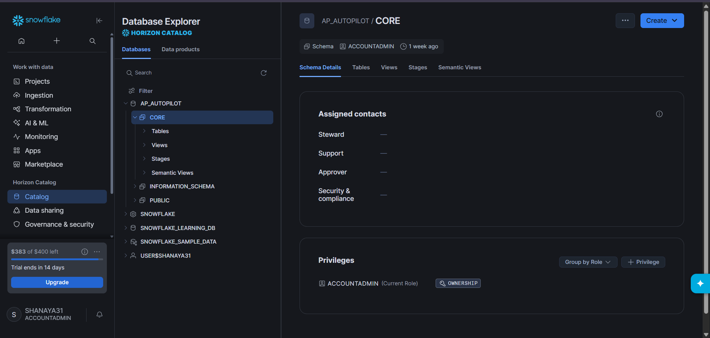

---

### AP Review Queue

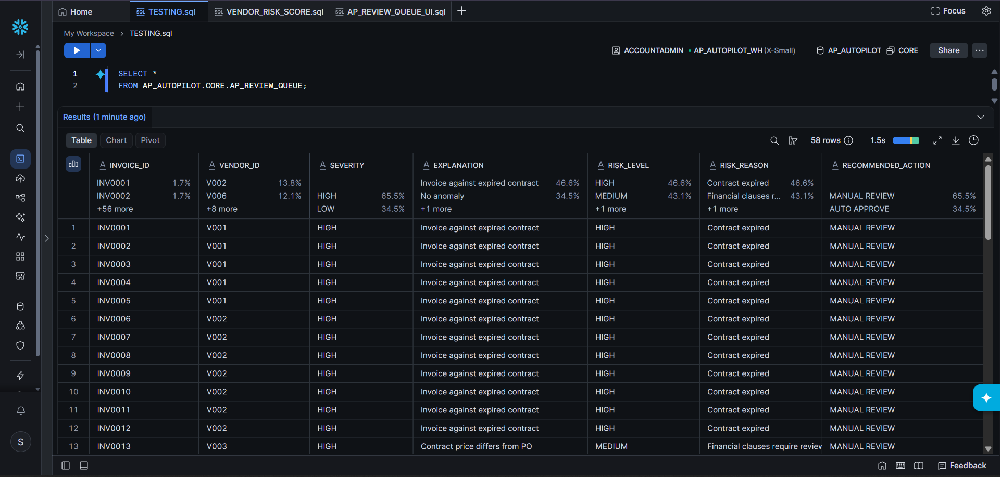

---

### Contract Clause Analysis

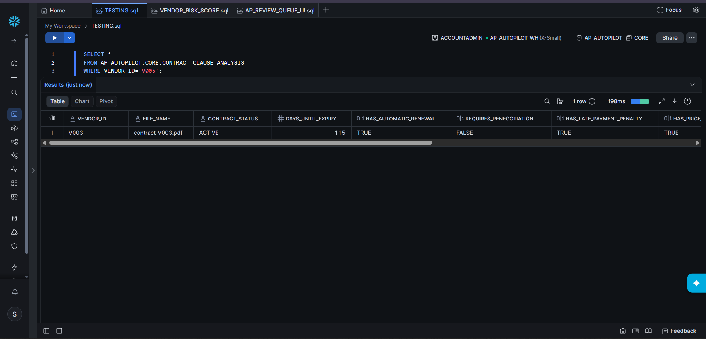

---

### Vendor Risk Score

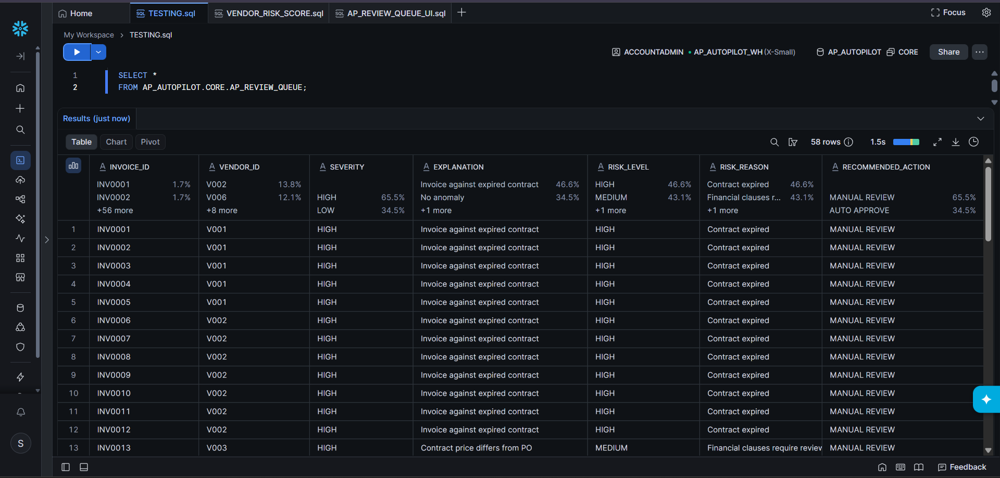

---

### Invoice Anomaly Results

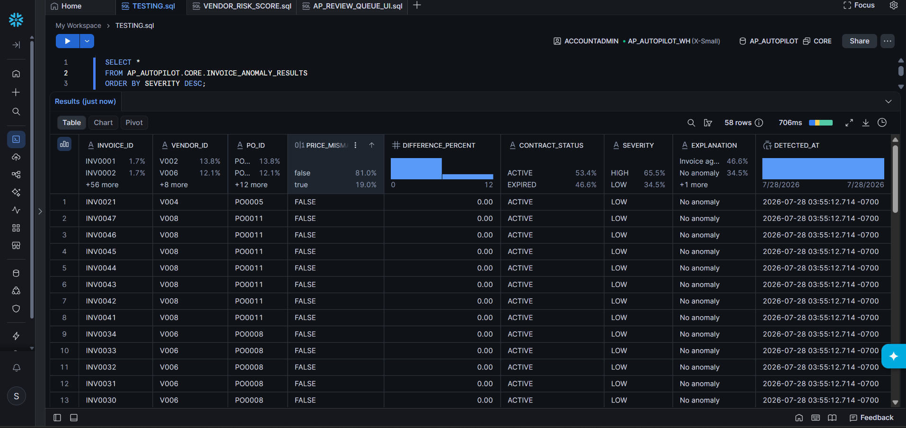

---

### Contract Price Check

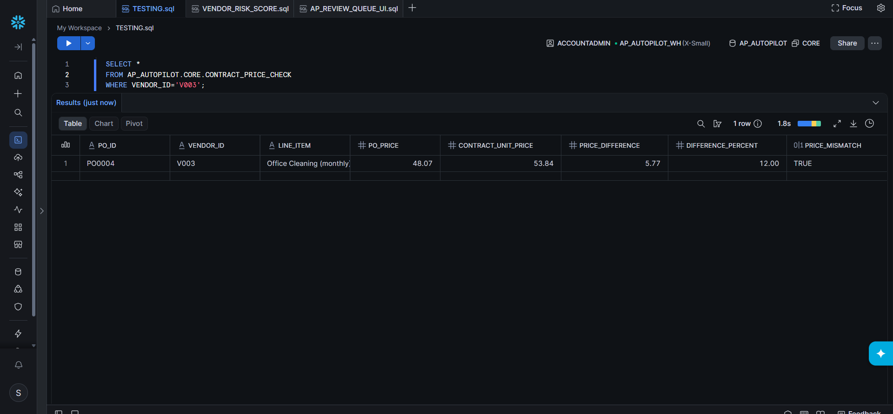

---

### Audit Log

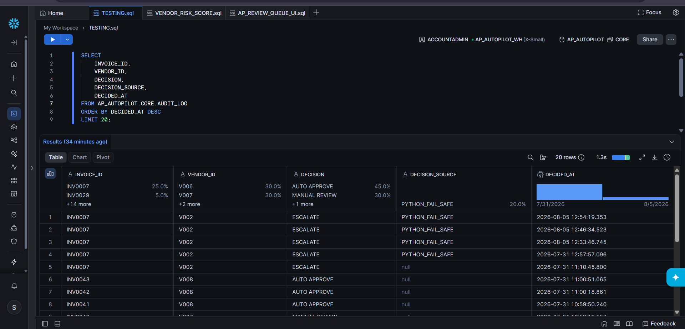

---

### CLI Demo

#### Escalated Invoice

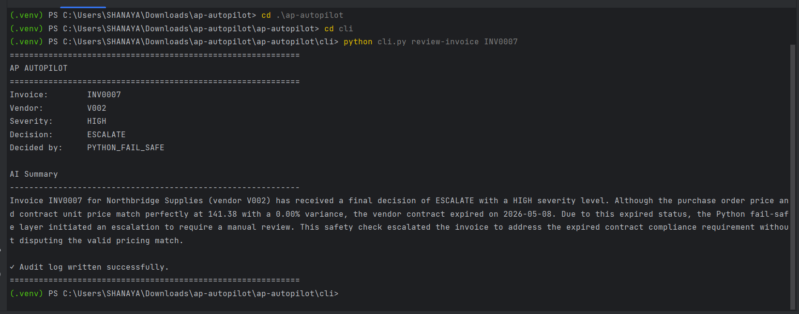

#### Manual Review

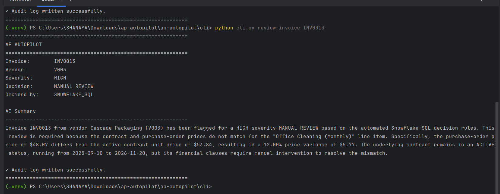

#### Auto Approval

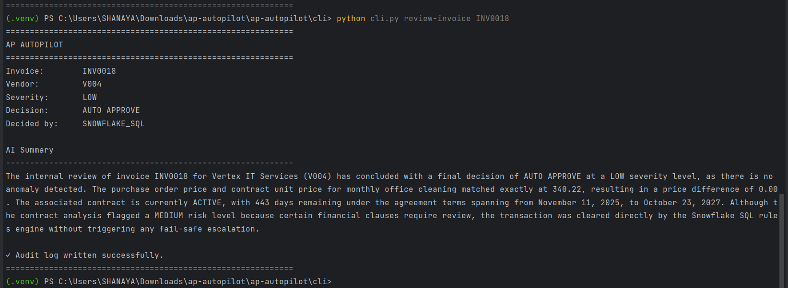

#### Contract Inspection

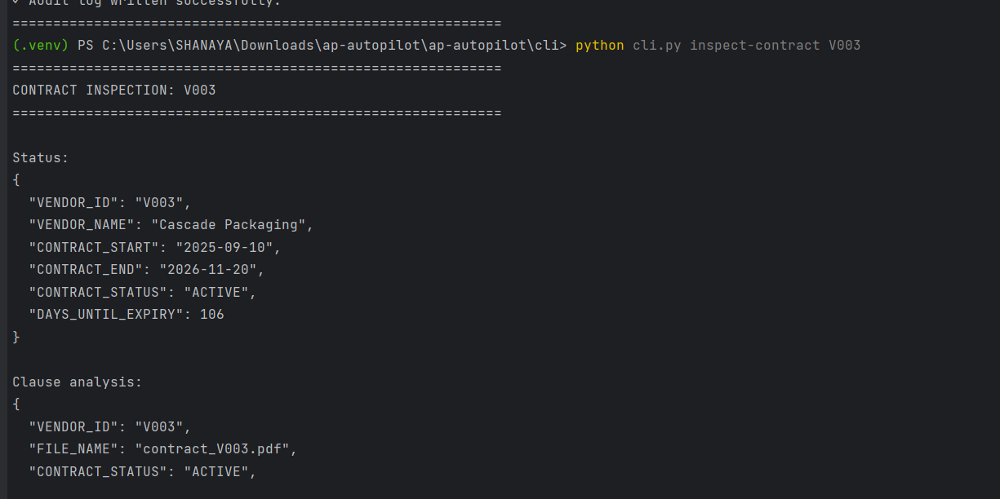

#### Invalid Input


---

## Installation

Clone the repository.

```bash
git clone https://github.com/<your-username>/ap-autopilot.git

cd ap-autopilot
```

Create a virtual environment.

```bash
python -m venv .venv
```

Activate it.

### Windows

```powershell
.venv\Scripts\activate
```

### Linux / macOS

```bash
source .venv/bin/activate
```

Install the required packages.

```bash
pip install -r requirements.txt
```

---

## Environment Variables

Create a `.env` file in the project root.

```text
SNOWFLAKE_ACCOUNT=

SNOWFLAKE_USER=

SNOWFLAKE_PASSWORD=

SNOWFLAKE_DATABASE=AP_AUTOPILOT

SNOWFLAKE_SCHEMA=CORE

SNOWFLAKE_WAREHOUSE=AP_AUTOPILOT_WH

GEMINI_API_KEY=

GEMINI_MODEL=gemini-2.5-flash
```

Never commit your `.env` file to GitHub.

---

## Running the Project

### 1. Generate Synthetic Data

Generate invoices, purchase orders, vendor records, and payment history.

```bash
python data/generate_synthetic_data.py
```

---

### 2. Generate Vendor Contracts

```bash
python data/generate_contracts.py
```

---

### 3. Convert Contracts to PDF

```bash
python data/convert_contracts_to_pdf.py
```

---

### 4. Upload Data to Snowflake

- Execute the SQL scripts in the `sql/` directory.
- Upload the generated CSV files.
- Upload the contract PDF documents to the `CONTRACT_DOCS` stage.

---

### 5. Review a Single Invoice

```bash
cd cli

python cli.py review-invoice INV0007
```

or

```bash
cd cli

python cli.py review-invoice INV0007
```

---

### 6. Scan All Review Queue Invoices

```bash
python cli.py scan-open-invoices
```

---

### 7. Inspect a Vendor Contract

```bash
python cli.py inspect-contract V003
```

---

## Decision Governance

A core design principle of AP Autopilot is the strict separation between business decisions and natural language generation.

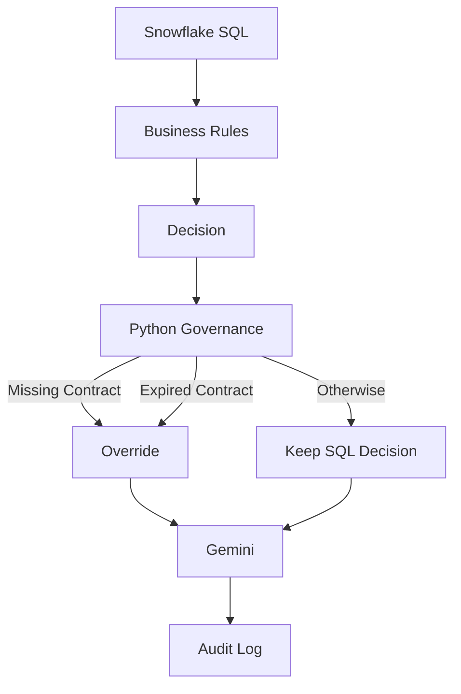

### Snowflake SQL

Snowflake SQL is the **single source of truth** for invoice validation.

It performs:

- Invoice anomaly detection
- Purchase order validation
- Contract price verification
- Vendor risk scoring
- Review queue generation

The SQL layer produces the initial recommendation for every invoice.

---

### Python Decision Layer

The Python CLI acts as a governance layer.

Rather than recomputing business rules, it retrieves the SQL recommendation and applies mandatory fail-safe checks for situations where governance requires stricter controls.

Examples include:

- Missing contract
- Expired contract

These scenarios automatically override the SQL recommendation and escalate the invoice.

Every override is recorded together with its **Decision Source**.

---

### Gemini

Gemini is never responsible for making financial decisions.

Its sole responsibility is converting structured evidence into concise business-friendly explanations.

Gemini cannot:

- approve invoices
- reject invoices
- escalate invoices
- change severity
- modify SQL outputs

This guarantees that every business decision remains deterministic, transparent, and fully auditable.

---

## Project Limitations

This project was developed using a Snowflake AI Data Cloud Trial account.

Some Cortex AI capabilities available in production accounts were unavailable during development, including:

- Cortex Complete
- Cortex Search embeddings
- AI_PARSE_DOCUMENT
- External Access Integrations

To preserve the intended architecture, equivalent deterministic workflows were implemented using:

- Snowflake SQL
- Python orchestration
- Google's Gemini API

This approach maintained complete functionality while ensuring that business decisions remained deterministic and fully auditable.

---

## Future Improvements

Potential enhancements include:

- Native Snowpark Container Services deployment
- Cortex Complete integration for explanation generation
- Cortex Search semantic retrieval for contract analysis
- Streamlit dashboard for finance teams
- Real-time invoice ingestion through Kafka
- Automated email notifications for manual reviews
- ERP integration with SAP and Oracle Financials
- Role-based approval workflows
- Support for multilingual vendor contracts
- Production deployment using Snowflake Native Apps

---

## License

This project is licensed under the MIT License.

See the [LICENSE](LICENSE) file for additional information.

---

## Author

**Shanaya Carvalho**

Computer Engineer | Data Engineering | Machine Learning | AI

GitHub: https://github.com/Shanaya31

LinkedIn: <your-linkedin-url>

If you found this project useful, consider giving it a ⭐ on GitHub.